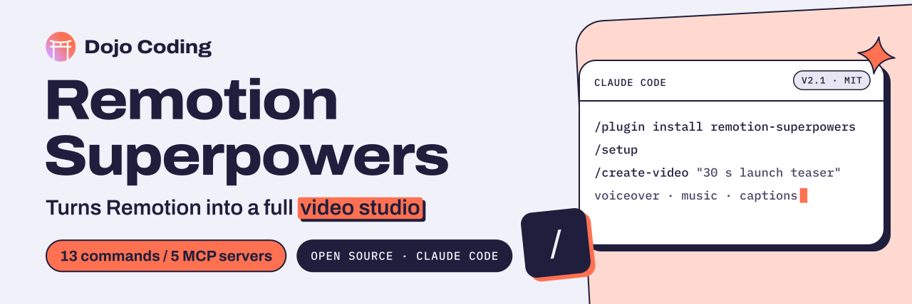

<picture>
  <source media="(prefers-color-scheme: dark)" srcset="examples/remotion/banner-dark.svg">
  <source media="(prefers-color-scheme: light)" srcset="examples/remotion/banner-light.svg">
  
</picture>

# dojo-readme-kit

**README banners in the [dojocoding.io](https://dojocoding.io) visual system, for every Dojo Coding open-source repo.**

One ink (navy `#201E3D`), one accent (peach `#FF7151`, fills only), paper `#F1F1F9`, one family
(Archivo), 2px rules and hard offset shadows. The generator shapes text with HarfBuzz and draws it
as outlines, so a banner renders the same on GitHub, npm and PyPI, in light and dark mode.

## Make a banner

Write `docs/assets/banner.toml` in your repo:

```toml
name = "Remotion Superpowers"
tagline = "Turns Remotion into a full [video studio]"   # [brackets] mark the one peach marker phrase
chips = ["13 commands / 5 MCP servers"]                  # peach chip: what the repo ships
meta = "Open source · Claude Code"                       # navy mono chip
tile = "/"                                               # the small code tile: "/", "{ }", "</>", ">_"

[card]
kind = "terminal"          # terminal | tools | ledger
label = "Claude Code"      # mono header of the card
status = "v2.1 · MIT"      # status chip, top right
lines = ["/plugin install remotion-superpowers", "/setup", ["/create-video", "\"30 s launch teaser\""]]
dim = "voiceover · music · captions"   # a quiet last line, closed by the peach caret
```

Then run it (needs [uv](https://docs.astral.sh/uv/); fonts download once):

```bash
uvx --from "git+https://github.com/DojoCodingLabs/.github#subdirectory=kit" dojo-banner docs/assets/banner.toml --preview
```

It writes `banner-light.svg` and `banner-dark.svg` next to the config, and PNG previews to your temp
directory when Chrome is installed. Commit the two SVGs and the config, never the previews.

Card motifs, always filled with real content from the repo:

| `kind` | For | Fields |
|---|---|---|
| `terminal` | CLIs, Claude Code plugins | `lines` (a string, or `["command", "quiet part"]`), optional `dim` |
| `tools` | MCP servers | `tools = ["draft_invoice", "lookup_taxpayer"]` |
| `ledger` | Toolkits, methodologies, the org banner | `rows = [["title", "subtitle", "chip"]]` |

Repos with their own data art (like [asamblea-api](https://github.com/DojoCodingLabs/asamblea-api)'s
hemicycle) import the package and pass a `body` callback to `dojo_banner.banner()`.

## The README frame

The order hacienda-cr set: banner, name, one bold line, badges, links, the repo's own content, footer.

```html
<p align="center">
  <a href="https://dojocoding.io">
    <picture>
      <source media="(prefers-color-scheme: dark)" srcset="docs/assets/banner-dark.svg">
      <source media="(prefers-color-scheme: light)" srcset="docs/assets/banner-light.svg">
      
    </picture>
  </a>
</p>

# NAME

**One sentence that says what it is.**
```

Badges: navy labels, peach values for what you choose, navy for runtimes, native colors for status.

```text
https://img.shields.io/badge/license-MIT-FF7151?labelColor=201E3D
https://img.shields.io/badge/python-3.11%2B-201E3D?labelColor=201E3D
https://img.shields.io/github/actions/workflow/status/OWNER/REPO/ci.yml?label=tests&labelColor=201E3D
```

Footer, last thing in the file:

```html
<p align="center">
  <a href="https://dojocoding.io"></a>
</p>
```

## House rules

- Archivo for everything; mono only for ledger labels and code.
- Peach is a fill, never text on a light background.
- No emoji in headings, no gradients outside the logo, no glow, no blur.
- Brand copy: no em dashes, "builder" over "developer", every claim with a date or a source.

Fonts: [Archivo](https://fonts.google.com/specimen/Archivo) and
[IBM Plex Mono](https://fonts.google.com/specimen/IBM+Plex+Mono), both OFL, fetched from
[google/fonts](https://github.com/google/fonts). The Dojo Coding marks in `dojo_banner/assets/` are
trademarks of Dojo Coding; use them only to identify Dojo Coding projects.

<p align="center">
  <a href="https://dojocoding.io"></a>
</p>
