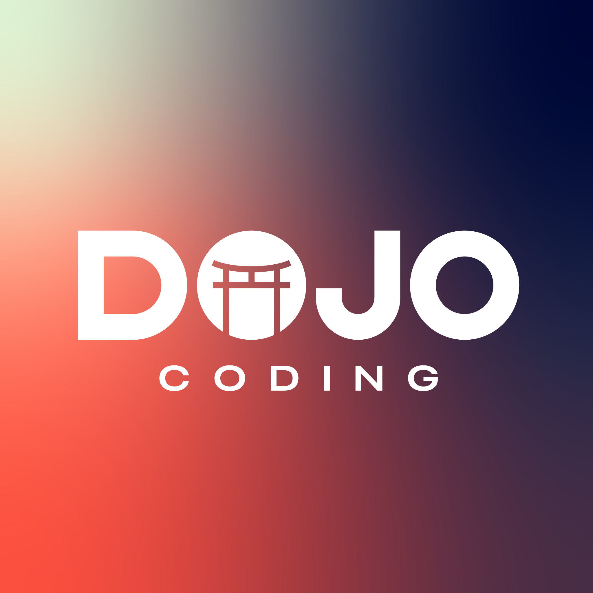

# 🥋 Dojo Coding

  

Welcome to **Dojo Coding** — a LATAM-first tech education ecosystem designed to help developers break salary barriers, master emerging technologies, and become founders.  

Our mission is simple:  
**Centralize talent to decentralize the world.**

---

## 🚀 What We Do

- 🎓 **Academy (Pathways)** — Master Web3, AI, and OSS with structured tracks, graded PRs, hackathons, and a portfolio that builds your Dojo-Score.
- 🧑‍💻 **Projects (Staffing)** — Get staffed on paid, real-world pods or hire vetted teams. Scoping, matching, delivery tracking, and payouts in one flow.
- 🚀 **Launchpad (Incubation)** — Turn ideas into products with mentors, startup playbooks, demo days, and investor access.
- 🌐 **Network & Events** — Join a high-signal community: meet peers, partners, and enterprise buyers through hackathons, workshops, and partner programs.

Dojo OS ties it all together—one login, one profile, one Dojo-Score—so every action (learning, shipping, selling) compounds your reputation and opportunity.

---

## 🔑 Get Started
- 🌐 Explore our academy → [dojocoding.io](https://dojocoding.io/pathways)
- 🏠 Join the community → [dojocoding.io](https://dojocoding.io)
- 📣 Follow us on X → [@dojo_coding](https://x.com/dojo_coding)

---

## 🤝 Contributing
Dojo Coding is **community-powered**. You can:  
- Join discussions and help fellow developers.  
- Contribute to open-source projects and playbooks.  
- Participate in hackathons and build with the ecosystem.  

Check out our [Contributing Guidelines](CONTRIBUTING.md) *(coming soon)*.

---

## 📜 License
Content and resources in this repository are released under the **MIT License**.  

---

## 📬 Contact
- **Website**: [dojocoding.io](https://dojocoding.io)  
- **Founder**: Daniel Bejarano → [@danielbejaranocr](https://x.com/0xBeja)  
- **Instagram**: [Dojo Coding](https://instagram.com/dojocoding_)  
- **X**: [Dojo Coding](https://X.com/dojo_coding)  

---
🥷 *Dojo Coding — The Blueprint for Global Developers*
